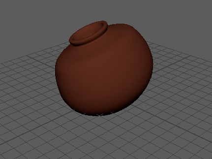

# 3D-Pot-Project

A simple 3D clay pot model created as part of my learning in 3D NURBS modeling and design.

## Preview
Here’s the pot:

## Tools Used
- Autodesk Maya (for modeling)

## About
This project helped me practice working with NURBS surfaces and shaping a smooth pot form. 

